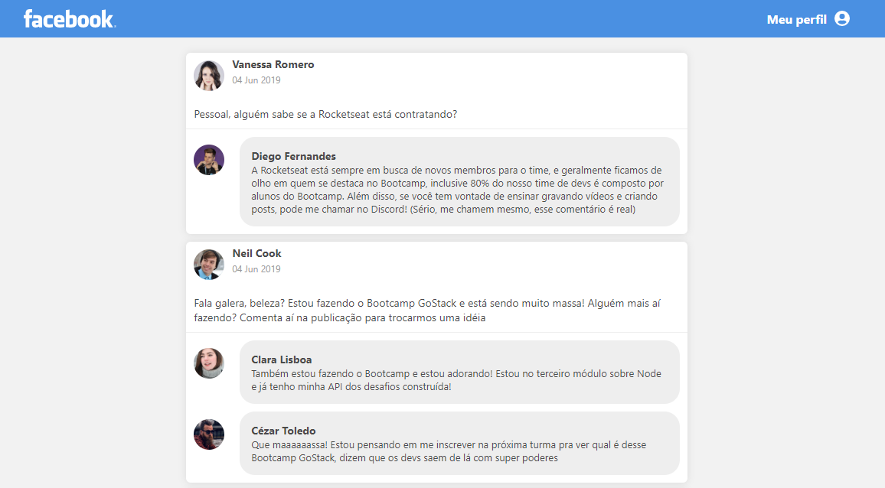

<h1 align="center">
    
</h1>

<h3 align="center">
  Desafio 4: Introdução ao React
</h3>

“Sucesso não é o resultado de um jogo, mas o destino de uma jornada”!</blockquote>

## :rocket: Sobre o desafio

Crie uma aplicação do zero utilizando **Webpack, Babel, Webpack Dev Server e ReactJS**.

Nessa aplicação você irá desenvolver uma **interface** semelhante com a do **Facebook** utilizando React.

As informações contidas na interface são **estáticas** e não precisam refletir nenhuma API REST ou back-end.

### Tela da aplicação

### Componentes

**Header:** Responsável por exibir a logo e o link para acessar o perfil;

**PostList:** Responsável por armazenar os dados da listagem de post, esses dados devem ficar dentro do `state` do componente e não em uma variável comum;

**Post:** Responsável por exibir os dados do post, esses dados devem vir através de uma propriedade recebida do componente PostList;

**Comment:** Responsável por exibir um comentário. Os dados do comentário virão por uma propriedade do componente. 